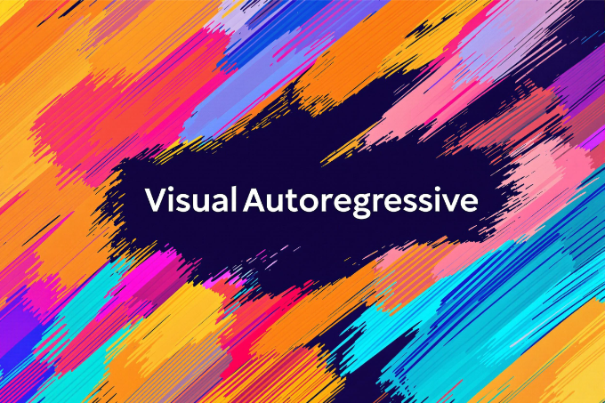

# Awesome Visual Autoregressive

This is a curated list of recent visual autoregressive modeling works, including image/video/3D/multi-modal generation and its application in other aspects (e.g., perception, etc.).

    

## Survey

- **Next Token Prediction Towards Multimodal Intelligence: A Comprehensive Survey**
  
  

- **Towards Unifying Understanding and Generation in the Era of Vision Foundation Models: A Survey from the Autoregression Perspective**
  

## Image Generation

- **MaskGIT: Masked Generative Image Transformer**
  
  

- **MAGVIT: Masked Generative Video Transformer**
  
  

- **RQ-VAE：Autoregressive Image Generation using Residual Quantization**
  
  

- **Towards Accurate Image Coding: Improved Autoregressive Image Generation with Dynamic Vector Quantization**
  
  

- **MAGVIT-v2：Language Model Beats Diffusion: Tokenizer is key to visual generation**
  
  

- **LlamaGen: Autoregressive Model Beats Diffusion: Llama for Scalable Image Generation**
  
  
  
- **VAR: Visual Autoregressive Modeling: Scalable Image Generation via Next-Scale Prediction**
  
  

- **MAR: Autoregressive Image Generation without Vector Quantization**
  
  
  
- **SAR: Customize Your Visual Autoregressive Recipe with Set Autoregressive Modeling**
  
  
  
  
- **Fluid: Scaling Autoregressive Text-to-image Generative Models with Continuous Tokens**
  

- **Infinity: Scaling Bitwise AutoRegressive Modeling for High-Resolution Image Synthesis**
  
  

- **Lumina-mGPT: Illuminate Flexible Photorealistic Text-to-Image Generation with Multimodal Generative Pretraining**
  
  

- **Taming Scalable Visual Tokenizer for Autoregressive Image Generation**
  
    

- **Open-MAGVIT2: An Open-Source Project Toward Democratizing Auto-regressive Visual Generation**
  
  

- **TiTok: An Image is Worth 32 Tokens for Reconstruction and Generation**
  
  
  

- **XQ-GAN: An Open-source Image Tokenization Framework for Autoregressive Generation**
  
    

- **ImageFolder: Autoregressive Image Generation with Folded Tokens**
  
    

- **DART: Denoising Autoregressive Transformer for Scalable Text-to-Image Generation**
  

- **M-VAR: Decoupled Scale-wise Autoregressive Modeling for High-Quality Image Generation**
  
  
  
- **CoDe: Collaborative Decoding Makes Visual Auto-Regressive Modeling Efficient**
  
  
  
  
- **VAR-CLIP: Text-to-Image Generator with Visual Auto-Regressive Modeling**
  
  
  
- **RandAR: Decoder-only Autoregressive Visual Generation in Random Orders**
  
  

- **RAR: Randomized Autoregressive Visual Generation**
  
  

- **MARS: Mixture of Auto-Regressive Models for Fine-grained Text-to-image Synthesis**
  
  

  
- **FlowAR: Scale-wise Autoregressive Image Generation Meets Flow Matching**
  
  

- **CAR: Controllable Autoregressive Modeling for Visual Generation**
  
  

- **CCA: Toward Guidance-Free AR Visual Generation via Condition Contrastive Alignment**
  
  

- **Scalable Autoregressive Image Generation with Mamba**
  
  

- **ControlVAR: Exploring Controllable Visual Autoregressive Modeling**
  
  
  
- **EditAR: Unified Conditional Generation with Autoregressive Models**
  
  
  
- **X-Prompt: Towards Universal In-Context Image Generation in Auto-Regressive Vision Language Foundation Models**
  
  

- **StarGen: A Spatiotemporal Autoregression Framework with Video Diffusion Model for Scalable and Controllable Scene Generation**
  

  
## Video Generation

- **Divot: Diffusion Powers Video Tokenizer for Comprehension and Generation**
  
  

- **DiCoDe: Diffusion-Compressed Deep Tokens for Autoregressive Video Generation with Language Models**
  
  
  
## 3D Generation

- **TAR3D: Creating High-quality 3D Assets via Next-Part Prediction**
  
  
  
## Multi-Modal
- **Transfusion: Predict the Next Token and Diffuse Images with One Multi-Modal Model**
 
 

- **Show-o: One Single Transformer To Unify Multimodal Understanding and Generation**
 
 

- **Liquid: Language Models are Scalable Multi-modal Generators**
 
 

- **Janus: Decoupling Visual Encoding for Unified Multimodal Understanding and Generation**
 
 

- **TokenFlow: Unified Image Tokenizer for Multimodal Understanding and Generation**
 
 

- **VILA-U: a Unified Foundation Model Integrating Visual Understanding and Generation**
 
 

- **MMAR: Towards Lossless Multi-Modal Auto-Regressive Probabilistic Modeling**
 

